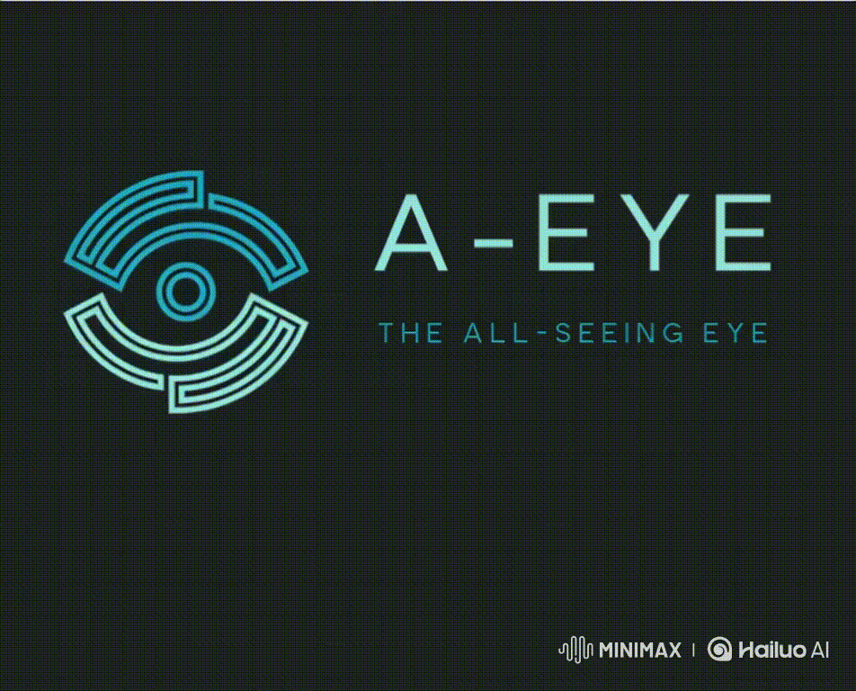

# 🧠 A-EYE Surveillance System




**A-EYE** is an intelligent surveillance system that uses computer vision and AI to detect suspicious behavior and identify potential thieves in real-time. It performs facial analysis to estimate **age**, **gender**, and **race** for enhanced profiling and threat assessment. Additionally, **A-EYE** provides customer analytics, including satisfaction insights.

---

## 🚀 Features

- 👁️ Real-time detection of **suspicious behavior**
- 🕵️ Identification of **potential thieves**
- 🧓 Age, 👩 Gender, and 🌍 Race prediction via facial recognition
- 🧠 Powered by state-of-the-art AI and deep learning models

---

## 🔍 Use Cases

- Retail theft detection
- Smart building security
- Public safety monitoring (malls, stations, airports)
- Law enforcement support systems

---

## 🛠️ Tech Stack

- YOLOv8
- Python
- OpenCV
- TensorFlow
- PyTorch
- Matplotlib
- DeepFace


## 🧱 System Architecture

```text
┌────────────┐     ┌─────────────┐   
│ Video Feed │──▶▶│ Preprocessor│
└────────────┘     └─────────────┘
    │                    │        
    ▼                    ▼        
Source from      Frame resizing,  
camera or file   FPS control      
(MP4, etc)                        
                 
          ┌─────────────┴───────────────┐
          ▼                             ▼
    ┌────────────────┐             ┌────────────────────┐
    │ Behavior Model │             │ Face Detection     │
    │ (CNN + LSTM)   │             │ + Demographic Model│
    └────────────────┘             └────────────────────┘
                ▲                               ▲
    Spatio-temporal motion patterns         Aligned face crops sent to
    analyzed for suspicious cues            deep learning model for:
    like loitering, quick grabs,            - Age group estimation  
    sudden direction changes, etc.          - Gender classification  
                                            - Race prediction

                         
```

---

## 📄 License

This project is licensed under the MIT License. See **LICENSE** for more details.


